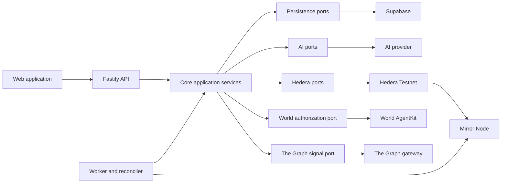
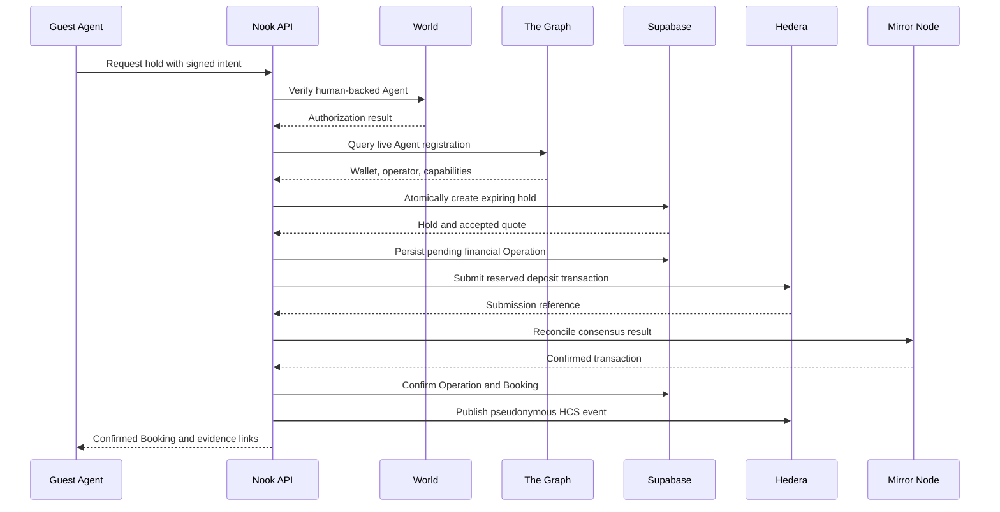

# Nook.rent architecture

Status: Phase 5 Hedera tracer complete with hosted state and live Testnet
deposit/HCS evidence

## Principles

1. Domain rules are independent of provider SDKs.
2. AI proposes and explains; deterministic policy authorizes and prices.
3. Financial writes are durable, idempotent, and recoverable.
4. Public evidence is pseudonymous and minimal.
5. Sponsor integrations are load-bearing and independently testable.
6. The web client has no provider secrets or signing authority.

## System view



## Monorepo

```text
apps/
  web/
  api/
  worker/
packages/
  core/
  config/
  ai/
  hedera/
  world/
  the-graph/
  supabase/
supabase/
  migrations/
```

### `apps/web`

Renders public Listings, search, Booking status, Host review, and sponsor
evidence. It communicates only with the API. The current tracer supports Host
and Guest demo roles, both approval paths, Listing draft confirmation, and
explicit operational states. It does not hold provider credentials or make
financial or authorization decisions.

### `apps/api`

Authenticates requests, validates HTTP input, calls application services, and
returns public read models. It is a composition root for provider adapters.

### `apps/worker`

Claims durable jobs, runs constrained Agent tasks, reconciles provider writes,
expires Reservation Holds, and rebuilds read projections. The current deposit
tracer exposes explicit reconciliation through the API; background Operation
claiming remains a later hardening step.

### `packages/core`

Owns entities, value objects, state machines, policies, use cases, and provider
ports. It has no dependency on Supabase, Hedera, World, The Graph, Fastify, or
the AI provider.

### Provider packages

Each provider package implements ports owned by `packages/core`. Provider
packages do not import or call one another. Cross-provider orchestration belongs
to an application service composed in the API or worker.

## Core aggregates

### Listing

Owns Host-controlled public offer data and publication state.

### Availability

Owns available date windows and the invariant that active holds and confirmed
Bookings do not overlap.

### Booking

Owns the approved terms and lifecycle for one stay.

### Reputation

Owns deterministic calculation from ordered, verified rental events.

### Operation

Owns idempotency and recovery for an external financial or evidence write.

## Source-of-truth matrix

| Concern                                                | Source of truth                                   |
| ------------------------------------------------------ | ------------------------------------------------- |
| Profiles, Listings, availability, and Booking metadata | Supabase                                          |
| Approval Policy and result                             | Stored Nook.rent policy evaluation                |
| Reservation Hold conflicts and expiry                  | Supabase transaction                              |
| Human-backed Agent authorization                       | World verification result                         |
| Agent registration and named Onchain Signals           | Live Graph provider response                      |
| Financial transaction outcome                          | Hedera consensus record via Mirror Node           |
| Public rental event history                            | HCS via Mirror Node                               |
| Rental Reputation                                      | Deterministic rebuild from verified rental events |
| UI evidence                                            | API read model derived from authoritative sources |

Provider results may be cached, but a cache does not override its authoritative
source.

## Booking orchestration



## Cross-provider failure handling

Supabase, World, The Graph, and Hedera cannot participate in one atomic
transaction.

The required pattern is:

1. validate stored Listing, quote, availability, and Approval Policy;
2. verify World and The Graph prerequisites;
3. atomically create an expiring Reservation Hold;
4. create a pending Operation with a stable idempotency key;
5. reserve the provider transaction identity;
6. submit the financial write;
7. reconcile through Mirror Node;
8. confirm the Booking and publish evidence;
9. release dates or retry safely after failure.

A submitted operation is not automatically failed because the initial request
timed out. Reconciliation decides its final state.

## AI architecture

The AI provider receives the minimum input required for one allowed task.

### Listing draft

Host facts and approved photos are transformed into a structured draft.
Inferences remain marked until Host confirmation.

### Search

Natural language becomes structured filters. The database applies hard filters;
the AI may rank and explain only the returned valid candidates.

### Commands

The Agent selects from a closed intent vocabulary. Application services load all
financial and authorization parameters from stored state.

## World architecture

- The Agent signs protected requests with its registered wallet.
- World AgentKit resolves whether that Agent is human-backed.
- Anonymous human identifiers and nonces are stored server-side only.
- Per-human hold limits prevent one person from blocking multiple Listings.
- World verification does not change Rental Reputation.

## The Graph architecture

- Query a live Graph gateway endpoint using a server-side API key.
- The baseline uses the Agent0 ERC-8004 Subgraph on a supported test network.
- Normalize provider responses into explicit Onchain Signal values.
- Fail closed for protected Agent registration checks.
- Do not expose the API key or raw provider response to the browser.
- Do not convert arbitrary wallet activity into Rental Reputation.

## Hedera architecture

- Use native Hedera SDKs and services on Testnet.
- Use HTS test tokens for demo settlement.
- Use HCS as a shared, versioned event log.
- Use Mirror Node for authoritative transaction and event read-back.
- Use Schedule Service only where delayed or signature-gated execution is part
  of the demonstrated workflow.
- Keep Testnet keys in environment configuration only.

The implemented deposit tracer stores its Operation before any network write
and reserves a stable Hedera transaction ID before submission. A submission
timeout moves the Operation to `reconciling`; it does not trigger a second
transfer. Mirror Node decides whether the transfer confirmed or failed.

On confirmation, one database transaction funds the Escrow, confirms the
Payment and Booking, and converts the Reservation Hold. HCS publication is a
separate retriable evidence step. Its payload contains only a pseudonymous
public evidence reference, token and amount, deposit transaction ID, network,
and funded state.

For the hackathon tracer, the configured operator is the demo token payer and
the configured escrow account is the receiver. This is a Testnet demonstration
model, not a production custody design.

## Supabase architecture

- All schema changes are versioned migrations.
- All Nook.rent-owned objects live in the isolated `nook` database schema.
- API and worker use server-side credentials.
- Browser access is denied by default until explicit row-level policies exist.
- Hold creation calls a security-definer database function that locks one
  Listing before checking and inserting dates.
- A request ID is unique and retries return the original Reservation Hold.
- Expiry is claimed in bounded batches with locked rows.
- Nook.rent tables must not depend on unrelated application tables.

The schema and repositories are implemented and tested against local
PostgreSQL. The first three migrations are applied to the isolated hosted
`nook` schema. The Phase 6 World authorization migration is locally verified
and remains an explicit hosted write.

## Deployment shape

- Web: static Vite application.
- API: Fastify server adapted for the selected hosting runtime.
- Worker: separately deployable process for leases, expiry, and reconciliation.
- Database: hosted Supabase Postgres.
- External networks: Hedera Testnet, World AgentKit networks, and a supported
  Graph provider network.

The API must expose `/health` and `/ready`. Readiness checks configuration and
required database access without submitting live blockchain operations.
