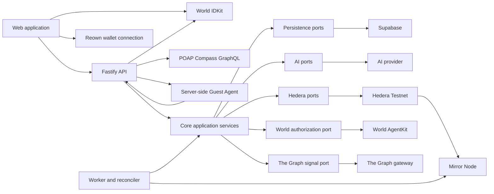
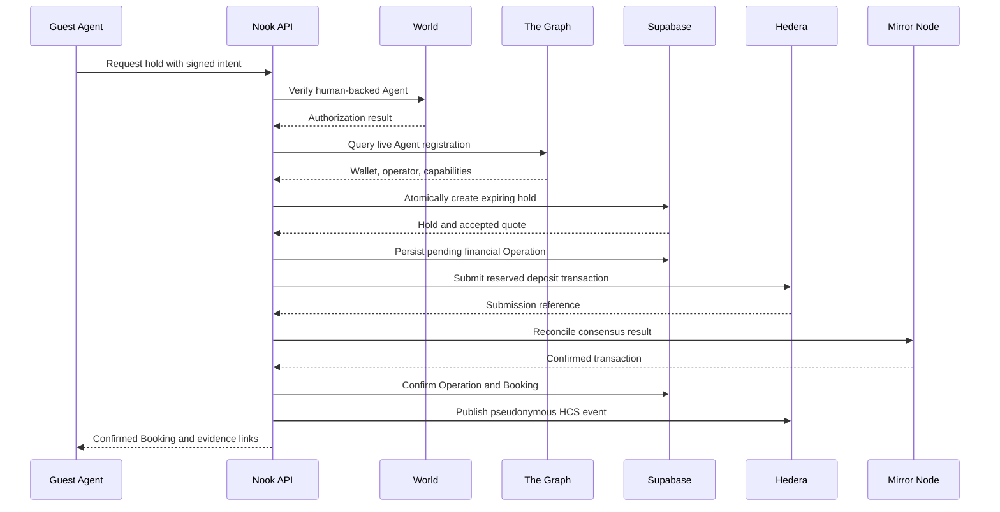

# Nook.rent architecture

Status: Phase 8 constrained marketplace Agents and guided demo UI implemented;
live OpenAI smoke evidence pending

## Principles

1. Domain rules are independent of provider SDKs.
2. AI proposes and explains; deterministic policy authorizes and prices.
3. Financial writes are durable, idempotent, and recoverable.
4. Public evidence is pseudonymous and minimal.
5. Sponsor integrations are load-bearing and independently testable.
6. The web client has no provider secrets or signing authority.

## System view



## Monorepo

```text
apps/
  web/
  api/
  worker/
packages/
  core/
  config/
  ai/
  hedera/
  world/
  the-graph/
  poap/
  supabase/
supabase/
  migrations/
```

### `apps/web`

Renders a guided Host and Guest journey across Member verification, Agent
connection, Listing creation, Agent review, search, Listing detail, Booking
Quote, Reservation Hold, Host review, deposit, and confirmation states. It
communicates with IDKit for the World App proof flow and otherwise only with the
API.
The UI includes clearly labeled seeded Rental Reputation profiles while the
real HCS projection is deferred; it never presents that demo data as live
sponsor evidence. It does not hold provider credentials or make financial or
authorization decisions.
For optional wallet evidence, Reown exposes only the connected EVM address and a
read-only message signature to the browser flow. The API validates the
short-lived signature before querying public ENS ownership through The Graph
and public POAP history through POAP Compass.

### `apps/api`

Authenticates requests, validates HTTP input, calls application services, and
returns public read models. It is a composition root for provider adapters. For
the guided demo it also exposes a narrow bridge to the server-side Guest Agent.
The browser may approve one bounded Agent Mandate to select the top
database-valid match, accept its deterministic quote, and request a protected
hold without receiving Agent signing material.
Listing search excludes overlapping live Reservation Holds and confirmed
occupancy before any Agent ranking. Expiring a Hold also expires its still
pending Booking so an abandoned attempt cannot reserve dates forever.

### `apps/worker`

Claims durable jobs, runs constrained Agent tasks, reconciles provider writes,
expires Reservation Holds, and rebuilds read projections. The current deposit
tracer exposes explicit reconciliation through the API; background Operation
claiming remains a later hardening step.

### `packages/core`

Owns entities, value objects, state machines, policies, use cases, and provider
ports. It has no dependency on Supabase, Hedera, World, The Graph, Fastify, or
the AI provider.

### Provider packages

Each provider package implements ports owned by `packages/core`. Provider
packages do not import or call one another. Cross-provider orchestration belongs
to an application service composed in the API or worker.

## Core aggregates

### Listing

Owns Host-controlled public offer data and publication state.

### Availability

Owns available date windows and the invariant that active holds and confirmed
Bookings do not overlap.

### Booking

Owns the approved terms and lifecycle for one stay.

### Reputation

Owns deterministic calculation from ordered, verified rental events.

### Operation

Owns idempotency and recovery for an external financial or evidence write.

## Source-of-truth matrix

| Concern                                                | Source of truth                                   |
| ------------------------------------------------------ | ------------------------------------------------- |
| Profiles, Listings, availability, and Booking metadata | Supabase                                          |
| Approval Policy and result                             | Stored Nook.rent policy evaluation                |
| Reservation Hold conflicts and expiry                  | Supabase transaction                              |
| Member Proof of Human                                  | World ID verification result                      |
| Human-backed Guest Agent authorization                 | World AgentKit verification result                |
| Agent registration and named Onchain Signals           | Live Graph provider response                      |
| Financial transaction outcome                          | Hedera consensus record via Mirror Node           |
| Public rental event history                            | HCS via Mirror Node                               |
| Rental Reputation                                      | Deterministic rebuild from verified rental events |
| UI evidence                                            | API read model derived from authoritative sources |

Provider results may be cached, but a cache does not override its authoritative
source.

## Booking orchestration



## Cross-provider failure handling

Supabase, World, The Graph, and Hedera cannot participate in one atomic
transaction.

The required pattern is:

1. validate stored Listing, quote, availability, and Approval Policy;
2. verify World and The Graph prerequisites;
3. atomically create an expiring Reservation Hold;
4. create a pending Operation with a stable idempotency key;
5. reserve the provider transaction identity;
6. submit the financial write;
7. reconcile through Mirror Node;
8. confirm the Booking and publish evidence;
9. release dates or retry safely after failure.

A submitted operation is not automatically failed because the initial request
timed out. Reconciliation decides its final state.

## AI architecture

The AI provider receives the minimum input required for one allowed task.

The Phase 8 composition uses the OpenAI Responses API with strict Structured
Outputs. If OpenAI is absent, unavailable, or returns invalid structured data,
the same core ports fall back to deterministic drafting, interpretation, and
ranking with the fallback state visible in the API and UI.

### Listing draft

Structured public Host facts and up to four approved HTTPS photos are
transformed into a structured draft. Inferences remain marked until Host
review. Saving the draft and publishing it are separate Host actions.

### Search

Natural language must resolve to city, dates, occupancy, optional maximum
nightly amount, and required amenities or return a clarification. Core validates
the 3–90-night range and atomic amount. The database applies hard filters before
the AI may rank and explain only those valid candidates. Unknown or duplicated
Listing IDs are rejected.

### Guest Agent Mandate

The Guest explicitly starts one secure-match action using the current natural
language request. The API interprets it into validated constraints, reruns hard
database filtering, and lets the Agent select only the first ranked valid
candidate. Stored Listing data and the interpreted date range create the
deterministic Booking Quote. The server-side Guest Agent then requests one
idempotent protected hold. Stored Host policy—not the Agent—returns automatic
approval or Host review.

### Commands

The Agent selects from a closed intent vocabulary. Application services load all
financial and authorization parameters from stored state. No AI provider
receives World proofs, signing material, exact property access data, or
financial authority.

## World architecture

- Both Host and Guest onboarding open the real IDKit World App QR flow.
- The API creates the signed RP context and keeps its signing key server-side.
- World verifies the profile-bound Proof of Human on the API.
- Supabase stores the action-specific nullifier privately to prevent reuse.
- Host and Guest are roles of one Member profile, so changing roles reuses the
  same successful Member verification.
- On restart, the browser asks the API for a boolean profile verification status
  and resumes the verified Member without requesting the same World action again.
- After direct Member verification, Guest onboarding performs live AgentBook
  and Agent0 capability checks, then shows only compact verified badges.
- The browser asks the server-side Guest Agent to perform the protected action.
- The Agent signs the AgentKit challenge with its registered wallet.
- The protected hold first rechecks the Guest's direct Member verification.
- World AgentKit then resolves whether that Agent is human-backed.
- Anonymous human identifiers and nonces are stored server-side only.
- The browser receives no Agent address, wallet key, signed header, World
  identifier, or nonce.
- Per-human hold limits prevent one person from blocking multiple Listings.
- World verification does not change Rental Reputation.

## The Graph architecture

- Query a live Graph gateway endpoint using a server-side API key.
- The baseline uses the Agent0 ERC-8004 Subgraph on Base Sepolia.
- The consented wallet-evidence path uses the official ENS Subgraph on Ethereum
  Mainnet and reports indexed names without treating them as reputation.
- Query the human-backed signing wallet as Agent wallet, registry owner, and
  operator.
- Require an active registration advertising
  `nook.rent:reservation-hold` before creating a protected hold.
- Check the same registration during Guest onboarding so the browser can show a
  truthful verified state before continuing.
- Normalize provider responses into explicit Onchain Signal values.
- Fail closed for protected Agent registration checks.
- Cache the normalized result briefly; never cache past the configured expiry.
- Do not expose the API key or raw provider response to the browser.
- Do not convert arbitrary wallet activity into Rental Reputation.

## Consented wallet evidence

- Reown AppKit connects an optional Guest EVM wallet; World ID remains the
  required private Member gate.
- The API issues a short-lived, integrity-protected message that states the
  read-only purpose.
- The Guest signs the message; no transaction or payment permission is
  requested.
- The API verifies wallet control before querying The Graph for indexed ENS
  ownership and POAP Compass for public participation history.
- Each result names its actual source; POAP Compass data is never presented as
  The Graph data.
- The browser receives named POAP counts and at most four recent public items,
  not the provider's complete response.
- Wallet evidence is not stored by the current demo and never changes Rental
  Reputation, approval, deposit, or Agent authorization.
- Missing history is neutral and never blocks the Guest flow.

## Hedera architecture

- Use native Hedera SDKs and services on Testnet.
- Use HTS test tokens for demo settlement.
- Use HCS as a shared, versioned event log.
- Use Mirror Node for authoritative transaction and event read-back.
- Use Schedule Service only where delayed or signature-gated execution is part
  of the demonstrated workflow.
- Keep Testnet keys in environment configuration only.

The implemented deposit tracer stores its Operation before any network write
and reserves a stable Hedera transaction ID before submission. A submission
timeout moves the Operation to `reconciling`; it does not trigger a second
transfer. Mirror Node decides whether the transfer confirmed or failed.

On confirmation, one database transaction funds the Escrow, confirms the
Payment and Booking, and converts the Reservation Hold. HCS publication is a
separate retriable evidence step. Its payload contains only a pseudonymous
public evidence reference, token and amount, deposit transaction ID, network,
and funded state.

For the hackathon tracer, the configured operator is the demo token payer and
the configured escrow account is the receiver. This is a Testnet demonstration
model, not a production custody design.

## Supabase architecture

- All schema changes are versioned migrations.
- All Nook.rent-owned objects live in the isolated `nook` database schema.
- API and worker use server-side credentials.
- Browser access is denied by default until explicit row-level policies exist.
- Hold creation calls a security-definer database function that locks one
  Listing before checking and inserting dates.
- A request ID is unique and retries return the original Reservation Hold.
- Expiry is claimed in bounded batches with locked rows.
- Nook.rent tables must not depend on unrelated application tables.

The schema and repositories are implemented and tested against local
PostgreSQL. The first five migrations, including the World AgentKit
authorization and idempotent-retry changes, are applied to the isolated hosted
`nook` schema. The sixth migration introduced private Host World ID
verification. The seventh locally implemented migration generalizes it to
private Member verification for both Host and Guest; the World ID migrations
remain pending an explicit hosted apply.

## Deployment shape

- Web: static Vite application.
- API: Fastify server adapted for the selected hosting runtime.
- Worker: separately deployable process for leases, expiry, and reconciliation.
- Database: hosted Supabase Postgres.
- External networks: Hedera Testnet, World AgentKit networks, and a supported
  Graph provider network.

The API must expose `/health` and `/ready`. Readiness checks configuration and
required database access without submitting live blockchain operations.
